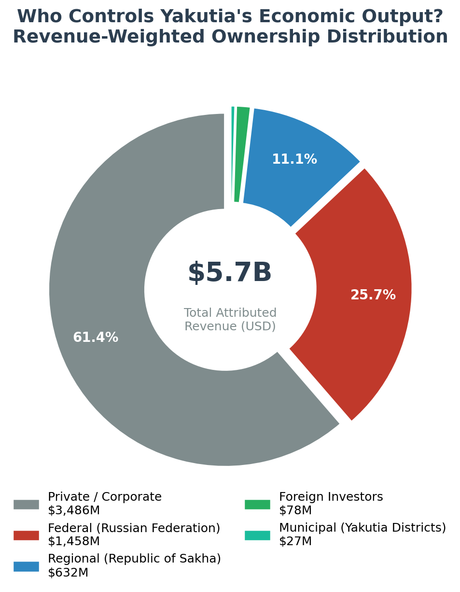
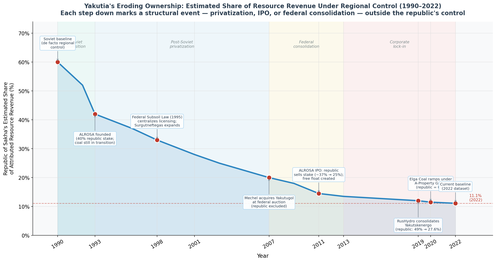
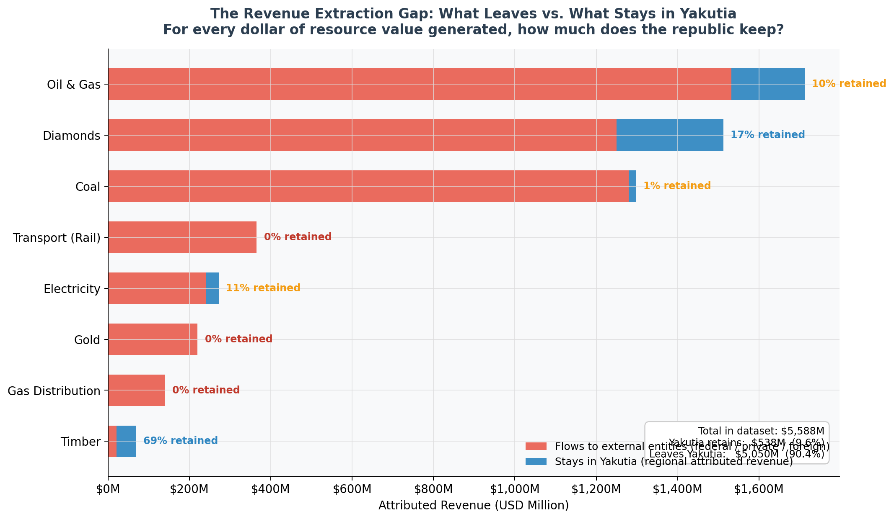
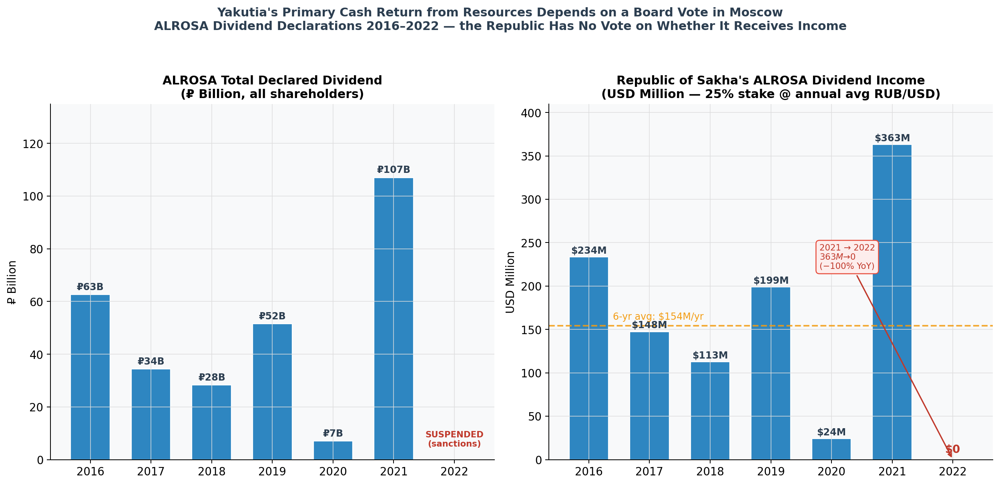

# Yakutia's Resource Empire: Who Owns It, Who Profits, and What the Republic Actually Gets

---

## 1. Introduction

The Republic of Sakha (Yakutia) is one of the world's most resource-endowed territories. It sits atop approximately 30% of global rough diamond reserves, vast Eastern Siberian oil and gas fields, and some of the planet's largest undeveloped coking coal deposits. By land area, it is larger than India. By population, it holds fewer than one million people.

The central question this analysis addresses: **who actually controls the wealth extracted from Yakutia, and how much of it flows back to the republic?**

This is not a trivial question. Yakutia's formal political status as a subject of the Russian Federation does not automatically translate into economic sovereignty over the resources beneath its soil. Ownership of productive assets — and the revenue streams they generate — is determined by corporate structures, federal statutes, and historical privatization decisions that have little to do with administrative boundaries.

This report maps asset-level ownership across Yakutia's key economic sectors, weights control by estimated revenue, and draws implications for the distribution of economic power between federal, regional, private, and foreign actors.

---

## 2. Data & Methodology

### 2.1 Data Sources

Ownership data was assembled from multiple primary sources:

| Source | Used For |
|--------|----------|
| ALROSA Annual Reports (2021–2023) | Diamond sector ownership structure |
| Mechel Annual Reports (2020–2023) | Coal (Yakutugol, Elga) ownership |
| Rosneft Annual Reports (2022) | TAAS-Yuryakh oil field ownership |
| RusHydro Annual Reports (2022) | Yakutskenergo electricity ownership |
| Republic of Sakha Government Portal | Regional enterprise stakes |
| Moscow Exchange (MOEX) disclosures | ALROSA free float; institutional shareholders |
| Indian Ministry of Petroleum statements | Indian consortium TAAS-Yuryakh acquisition |
| Rosstat / Republic of Sakha Statistics | Revenue estimates, GRP data |

### 2.2 Analytical Framework

The dataset covers **25 ownership records** across **8 asset sectors**: diamonds, oil & gas, coal, electricity, transport, gas distribution, gold, and timber. Each record represents a distinct ownership stake in a named asset.

These 8 sectors were selected to represent the commanding heights of Yakutia's economy — sectors where asset-level ownership data is accessible in public filings. Some industries with Yakutia exposure fall outside this scope: Polyus Gold's regional mining operations and Norilsk Nickel's logistics infrastructure through the territory are not disaggregated in public disclosures at the Yakutia level, and a full accounting of smaller timber and agriculture subsectors would require registry-level data not publicly available. The 25-record dataset is therefore a deliberate scoping choice that captures the bulk of extractive-sector economic value, not an exhaustive census.

**Revenue attribution** is calculated as:

> Attributed Revenue = Asset Annual Revenue × Ownership Percentage

This approach weights ownership by economic significance rather than treating all stakes equally. A 25% stake in a $4.2B company contributes more to the analysis than a 100% stake in a $95M airline.

**Ownership categories** used throughout:
- **Federal** — Russian Federation government, and federally controlled corporations (Rosneft, RusHydro, Gazprom, RZhD, Rosimushchestvo holding in ALROSA)
- **Regional** — Republic of Sakha (Yakutia) government and republic-controlled enterprises
- **Municipal** — District-level governments within Yakutia (primarily ALROSA minority stakes)
- **Private** — Privately held Russian corporations, oligarch-controlled entities, and public market float
- **Foreign** — Non-Russian entities (Indian energy consortium, BP Russia pre-2022)

### 2.3 Limitations

**1. Beneficial ownership opacity.** Surgutneftegas — the largest single oil producer in Yakutia — has one of the most opaque ownership structures in Russian corporate history. The registered corporate entity is used; actual beneficial control is unknown. This likely understates private/oligarch influence.

**2. Post-2022 sanctions disruption.** BP Russia's stake in TAAS-Yuryakh and other foreign ownership positions became legally and practically uncertain after February 2022. This analysis uses the **pre-2022 ownership baseline** as a stable analytical reference. Post-2022 restructuring is ongoing and not yet fully public.

**3. Revenue estimation.** Exact Yakutia-specific revenues are not disclosed by most companies at a regional level. Estimates are derived from production volumes, commodity prices, and disclosed group revenues, then allocated proportionally. Figures should be treated as **indicative order-of-magnitude estimates**, not accounting-grade figures.

**4. ALROSA complex structure.** ALROSA is itself a mixed-ownership entity (federal + regional + municipal + private). Its subsidiaries (e.g., Almazy Anabara) are categorized based on ALROSA's effective control, not the multi-layered parent structure.

**5. Elga Coal ramp-up.** The Elga Coal Complex is in early production ramp-up (2022–2023). Revenue figures reflect early-stage output, not the full production potential of what may become one of the world's largest coking coal operations.

---

## 3. Key Findings

### Finding 1: Federal and Private Entities Dominate Economic Control

Analysis shows that **federal entities and private corporations together control approximately 80% of total attributed revenue** in Yakutia's key sectors. The Republic of Sakha — the political entity that governs the territory — directly controls less than 10%.

This is not incidental. It reflects deliberate structural choices made during Soviet-era enterprise design and post-Soviet privatization:
- ALROSA was structured as a joint-stock company with federal majority — not a regional asset
- Rosneft expanded into Eastern Siberia through federal policy, not regional invitation
- Mechel acquired Yakutugol through a federal privatization process

The regional government's most significant direct holding is a **25% stake in ALROSA** — meaningful but minority.

### Finding 2: Natural Resources Are Controlled Externally

In every major extractive sector, external entities hold majority control:

| Sector | Dominant Controller | Regional Share |
|--------|--------------------|-|
| Diamonds (ALROSA) | Federal (33%) + Private Float (34%) | 25% (direct) + 8% (municipal) |
| Coal (Yakutugol/Mechel) | Private (Mechel Group) | 20% (Neryungri zone only) |
| Coal (Elga Complex) | Private (A-Property Group) | 0% |
| Oil & Gas (TAAS-Yuryakh) | Federal (Rosneft) | 0% |
| Oil & Gas (Surgutneftegas) | Private (opaque) | 0% |
| Electricity | Federal (RusHydro 72%) | 27.6% (minority) |
| Railways | Federal (RZhD 100%) | 0% |

The pattern is consistent: **Yakutia produces the resources; others own the companies that extract them.**

### Finding 3: Power is Highly Concentrated

The top 5 controlling entities account for over 70% of total attributed revenue in the dataset. This reflects extreme economic concentration:

1. **Surgutneftegas** (private, opaque) — single largest attributed revenue block from Yakutia oil operations
2. **Public Investors (ALROSA free float)** — private market participants through MOEX trading
3. **Russian Federation / Rosimushchestvo** — federal stake in ALROSA
4. **Mechel Group** — coal sector (Yakutugol + Neryungri)
5. **Rosneft** — federal petroleum dominance via TAAS-Yuryakh

The Republic of Sakha does not appear in the top 5.

### Finding 4: Strategic Importance Does Not Align with Regional Control

Among assets classified as **high strategic importance** — diamonds, coal, major oil fields, power infrastructure — the Republic of Sakha controls approximately **11–13%** of attributed revenue. This is the fundamental asymmetry at the heart of Yakutia's economic predicament:

> The assets most critical to the republic's economic future are the ones over which it has the least control.

Regional control is comparatively stronger only in:
- Yakutia Airlines (99% — but small absolute revenue)
- Sakhaneftegazprom (100% — but limited production scale)
- Partial Yakutskenergo stake (27.6% — subordinate to RusHydro)

### Finding 5: Municipal Stakes Represent an Underappreciated Mechanism

The 8% municipal stake in ALROSA, distributed across Yakutia's raions (districts), represents approximately **$336M in attributed revenue** — more than the entire Yakutia Airlines operation. This mechanism, designed at ALROSA's founding, ensures some resource revenue flows to local communities directly. It is a structural feature rarely discussed but economically significant at the district level.

### Finding 6: Yakutia's Ownership Share Has Been Systematically Eroded Since 1990

The 2022 figure of 11.1% regional control is not a static starting point — it is the endpoint of a 32-year process of structural erosion. Reconstructing ownership through documented events shows that the Republic of Sakha once exercised de facto control over the majority of economic output from its territory.

| Period | Est. Regional Share | Driving Event |
|--------|-------------------|---------------|
| 1990 | ~60% | Soviet baseline: regional party structures directed enterprise output |
| 1993 | ~42% | ALROSA founded with 40% regional stake; coal sector still transitioning |
| 1998 | ~33% | Federal Subsoil Law (1995) centralizes licensing; Surgutneftegas expands |
| 2007 | ~20% | Mechel acquires Yakutugol at federal auction — republic excluded from mining |
| 2011 | ~14.5% | ALROSA IPO on MOEX dilutes republic's stake from ~37% to 25% |
| 2019 | ~12% | RusHydro consolidates Yakutskenergo; republic's electricity stake cut from ~49% to 27.6% |
| 2022 | 11.1% | Current baseline (post-sanction, BP exit from TAAS-Yuryakh) |

**Net erosion: −49 percentage points over 32 years**, averaging roughly −1.5 pp/year. Crucially, this is not a story of mismanagement or extraction by corrupt officials. Every step was either a federal policy decision (subsoil law, privatization auction rules, federal consolidation of RusHydro) or a corporate transaction (ALROSA IPO proceeds partly went to the republic's own budget, but at the cost of permanent dilution). Yakutia largely participated in — and was unable to refuse — each transition.

### Finding 7: The Revenue Retention Gap Makes the "Resource Curse" Concrete

When revenue is broken down by sector, the abstract claim that "Yakutia doesn't benefit from its resources" becomes numerically precise:

| Sector | Total Attributed Revenue | Yakutia Retains | Retention Rate |
|--------|------------------------|-----------------|----------------|
| Coal | $1,298M | $18M | 1.4% |
| Transport (Rail) | $365M | $0 | 0% |
| Gas Distribution | $140M | $0 | 0% |
| Gold | $220M | $0 | 0% |
| Oil & Gas | $1,712M | $180M | 10.5% |
| Diamonds | $1,512M | $263M | 17.4% |
| Electricity | $272M | $30M | 11.2% |
| Timber | $69M | $48M | 69.6% |

The timber sector — by far the smallest — actually shows the highest retention rate (69.6%), because it is the only sector where the republic retains majority ownership of enterprises. The three largest revenue sectors (oil & gas, coal, diamonds) together generate $4.5B in attributed revenue, of which Yakutia keeps $461M — roughly **10 cents on every dollar** extracted from its land.

---

## 4. Economic Implications

### 4.1 Revenue Leakage

Corporate profits from Yakutia's resource industries are consolidated at group level by entities headquartered in Moscow (ALROSA head office, Mechel, Rosneft, Surgutneftegas, Gazprom, RusHydro, RZhD). Dividends and profits flow to shareholders and the federal budget, not automatically to the Republic of Sakha.

Yakutia receives resource revenues through three narrow channels:
1. **Direct dividends** from its ALROSA stake and Sakhaneftegazprom operations
2. **Tax revenues** — but corporate profit taxes are often paid at the parent entity's registered location (Moscow), not at the point of extraction
3. **Federal transfers** — the republic is a recipient of federal budget transfers, creating a dependency relationship

This structure means Yakutia is a **resource colony in the fiscal sense**: it generates value but receives it back through politically mediated transfers rather than direct ownership rights.

### 4.2 Limited Regional Agency

The Republic of Sakha government cannot unilaterally change extraction rates, investment plans, or revenue-sharing arrangements for ALROSA, Rosneft, or Surgutneftegas assets. Decisions about mine development, pipeline routing, and capital allocation are made in Moscow boardrooms or by private shareholders — not in Yakutsk.

This creates structural vulnerability: if global diamond prices fall, if Mechel's debt position forces asset sales, or if federal energy policy changes, Yakutia's economic situation changes — without the republic having meaningful control over the outcome.

### 4.3 The ALROSA Paradox

ALROSA is simultaneously Yakutia's greatest asset and its most revealing constraint. The company produces approximately 30% of the world's rough diamonds from Yakutia's kimberlite pipes. Yet:
- The federal government holds majority influence (33% Rosimushchestvo + ability to influence management)
- Yakutia holds a permanent but minority 25% stake
- Dividend policy is set by a board dominated by federal and private interests
- Pricing and marketing are controlled by ALROSA's Moscow-based management

The republic's 25% stake is **real wealth, but constrained power**. It entitles Yakutia to a dividend check, not a seat at the strategy table. Beyond dividend rights, the ALROSA stake has historically functioned as Yakutia's primary political bargaining chip in federal negotiations — the republic's most credible claim on the federation's attention. This dimension helps explain why Yakutia agreed to the 2011 MOEX IPO that diluted its holding from ~37% to 25%: it received a capital inflow to its regional budget, but permanently traded a degree of political leverage for fiscal liquidity. The republic chose cash over influence, at a moment when it needed both.

### 4.4 The Dividend Trap: Fiscal Dependency on a Corporate Decision

Because the Republic of Sakha's most significant direct revenue from resources flows through its 25% ALROSA stake as dividends, the republic's fiscal position is structurally exposed to a decision made by a corporate board in Moscow. The republic has no legal mechanism to compel dividend payments — it receives whatever ALROSA's board declares, when it declares it.

ALROSA dividend history (Republic of Sakha's 25% share, USD equivalent):

| Year | ALROSA Total Dividend | Republic's Share | Note |
|------|----------------------|-----------------|------|
| 2016 | ₽62.6B | ~$233M | Strong diamond cycle |
| 2017 | ₽34.4B | ~$147M | Partial-year payout |
| 2018 | ₽28.3B | ~$113M | Conservative policy |
| 2019 | ₽51.5B | ~$199M | Demand recovery |
| 2020 | ₽7.0B | ~$24M | COVID — board cut to minimum |
| 2021 | ₽107.0B | ~$362M | **Record** — diamond demand surge |
| 2022 | ₽0 | **$0** | **Suspended** — Western sanctions on diamond exports |

The swing between 2021 and 2022 — from $362M to $0 — represents a loss of income larger than the entire annual revenue of Yakutia Airlines, vanishing in a single year due to a geopolitical event that Yakutia had no part in causing and no mechanism to mitigate. This is not a hypothetical risk; it happened.

This volatility has a direct structural implication: Yakutia cannot plan multi-year infrastructure investment or social expenditure on the basis of dividend income that may or may not arrive. The republic compensates by relying heavily on federal budget transfers, which by most estimates cover 60–70% of the regional budget — completing the dependency loop.

> The sequence is: Russia extracts resources from Yakutia → revenue flows to Moscow-headquartered corporations → Yakutia receives a portion back as dividends (when declared) → when dividends disappear, federal transfers substitute → Yakutia remains dependent on federal political goodwill at every step.

---

## 5. Post-2022 Structural Changes: Open Questions

The pre-2022 baseline used in this analysis represents a period of relative stability in Yakutia's ownership structure. The events of 2022 and their aftermath have introduced disruptions whose full implications remain unclear:

- **ALROSA sanctions**: Western sanctions on Russian diamond exports cut ALROSA off from its primary markets (Belgium's Antwerp hub, US retail). The $0 dividend in 2022 is the most visible symptom; the deeper question is whether ALROSA can rebuild market position through India and China routing, and at what sustained price discount.
- **BP Russia exit from TAAS-Yuryakh**: BP Russia's stake — held alongside the Indian consortium — entered legal limbo after February 2022. The long-term ownership resolution of TAAS-Yuryakh is not yet public.
- **Foreign investor category in flux**: If foreign stakes are absorbed by Rosneft or transferred domestically, the effective federal share increases further, deepening the structural pattern this analysis documents.
- **Elga Coal ramp-up under sanctions**: A-Property Group's Elga operation was partly financed on Asian market assumptions. Sanctions accelerated Russia's coal pivot toward Asia, which may benefit Elga's ramp timeline — but on terms not yet disclosed.

These open questions do not invalidate the structural analysis — the underlying ownership architecture and the erosion dynamic remain intact — but they underscore that the quantitative figures in this report are a baseline, not a current-state snapshot. The story of Yakutia's ownership structure did not stop in 2022; it entered a new phase of greater opacity.

---

## 6. Conclusion

Yakutia's economic structure can be summarized in one sentence:

> **The Republic of Sakha (Yakutia) is among the world's richest territories by resource endowment and among the most constrained by economic structure — hosting vast natural wealth while controlling a small fraction of the entities that extract and monetize it.**

The analysis shows that ownership of key resource assets is heavily concentrated among federal and large corporate entities, with the Republic of Sakha holding meaningful but minority stakes in most sectors and zero presence in others. Economic control over Yakutia's most strategic assets flows primarily from Moscow and from the boardrooms of private corporations — not from Yakutsk.

This is not corruption, and it is not necessarily exploitation in a simple sense. It is the outcome of a structural logic — Soviet-era enterprise design, federal resource law, post-Soviet privatization — that consistently placed control of Russia's most valuable assets at the federal and private level, regardless of where those assets are geographically located.

The policy implication, should the Republic of Sakha seek greater economic sovereignty, would require changes to ALROSA's ownership structure, federal subsoil licensing law, and corporate tax attribution rules — all of which lie well outside the republic's current authority. Until those structures change, Yakutia will continue to be, in the deepest economic sense, a land that belongs to others.

---

*Analysis period: 2021–2022 (pre-sanction baseline). Revenue figures are indicative estimates in USD millions.*  
*Historical ownership trend estimates (1990–2022) are reconstructed from documented corporate events, not accounting-grade data.*  
*ALROSA dividend figures sourced from ALROSA annual reports; USD conversions use annual average RUB/USD rates.*  
*Full methodology and data sources: see `docs/sources.md`*  
*Dataset: `data/cleaned/yakutia_assets.csv`*

**Visualizations:**
- `outputs/charts/01_ownership_donut.png` — Revenue-weighted ownership distribution
- `outputs/charts/02_top_entities_bar.png` — Top 10 controlling entities
- `outputs/charts/03_sector_ownership_heatmap.png` — Revenue control by sector and owner type
- `outputs/charts/04_strategic_vs_ownership.png` — Strategic importance vs. ownership
- `outputs/charts/05_ownership_erosion_trend.png` — **Yakutia's eroding ownership 1990–2022**
- `outputs/charts/06_revenue_extraction_gap.png` — **Revenue extraction gap by sector**
- `outputs/charts/07_alrosa_dividend_volatility.png` — **ALROSA dividend volatility & fiscal exposure**
